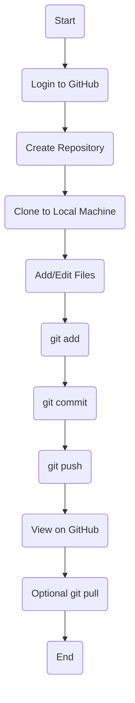

Here’s a **premium, styled README.md** with badges, clean UI, and modern GitHub design (perfect for college + portfolio 🔥):

---

# 🚀 EXP-15: GitHub Repository Setup & Version Control

<p align="center">
  
  
  
  
</p>

---

## 🎯 Aim

> To create and manage a GitHub repository for an AI-related project, perform version control operations, and enable collaboration using Git.

---

## 🧰 Tech Stack

<p align="center">
  
</p>

---

## 📖 Overview

This experiment demonstrates how to use **GitHub as a central platform** for managing project files.
It includes repository creation, file tracking, commits, pushing code, and basic collaboration.

---

## ⚙️ Workflow



---

## 🧠 Algorithm

```txt
1. Start  
2. Login to GitHub  
3. Create a new repository  
4. Add repository details  
5. Initialize with README (optional)  
6. Open project folder locally  
7. Initialize Git  
8. Add files (git add)  
9. Commit changes  
10. Connect to remote repository  
11. Push files to GitHub  
12. Verify repository  
13. (Optional) Collaboration via branches  
14. End  
```

---

## 💻 Git Commands

```bash
git init
git status
git add .
git commit -m "Initial commit"
git remote add origin <repo_url>
git push -u origin main
git pull origin main
```

---

## 📊 Features Implemented

✨ Repository Creation
✨ Version Control (Git)
✨ Commit Tracking
✨ Remote Push & Pull
✨ Basic Collaboration

---

## 📸 Output Preview

> ✔ Repository successfully created
> ✔ Files uploaded and tracked
> ✔ Changes visible on GitHub

---

## 🏁 Result

✅ Successfully implemented GitHub repository setup
✅ Performed version control operations
✅ Understood collaboration workflow

---

## 💡 Pro Tips

* Use meaningful commit messages 🧾
* Always check `git status` before commit
* Use branches for teamwork 🌿
* Keep your README clean & informative

---

## 👨‍💻 Author

**Ram Creations**
🎨 UI/UX Designer | 💻 Developer

---

## ⭐ Bonus (Portfolio Ready)

If you push this to GitHub, add this at top:

```md
<p align="center">
  
</p>
```

---
